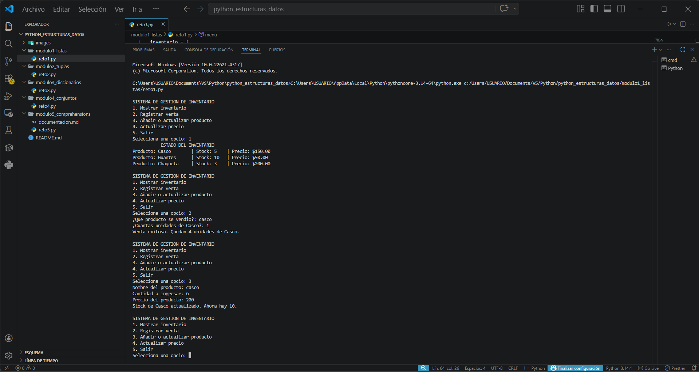
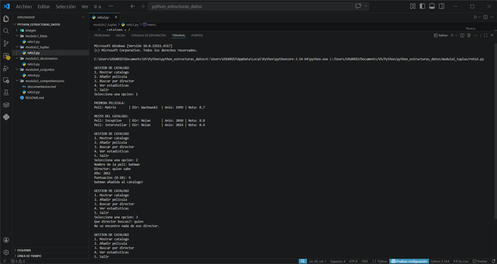
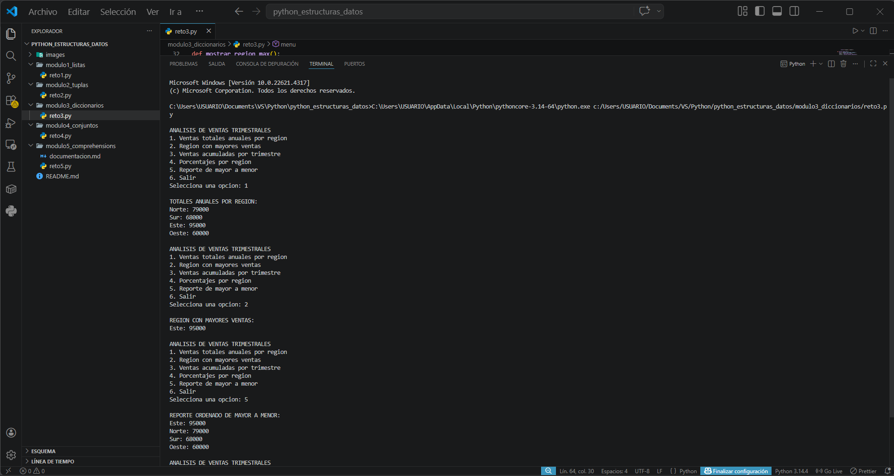
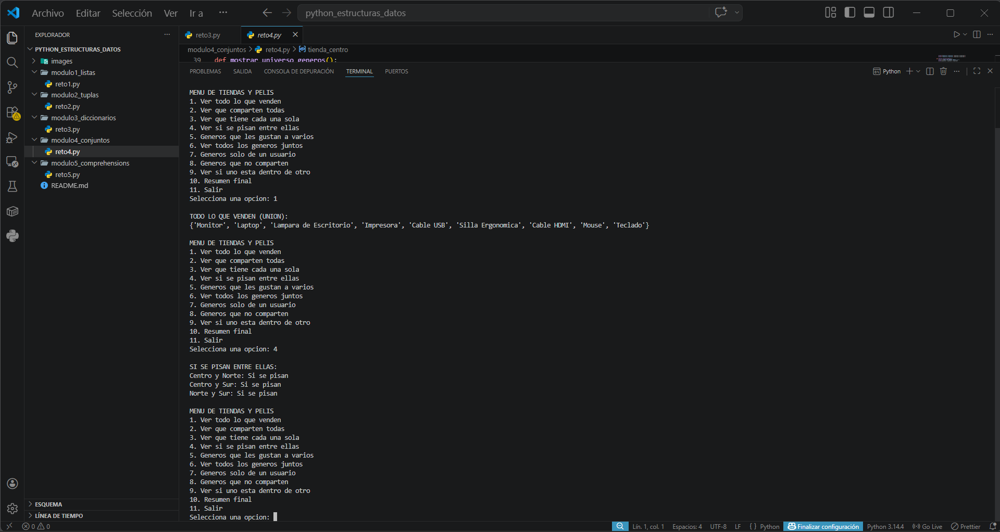
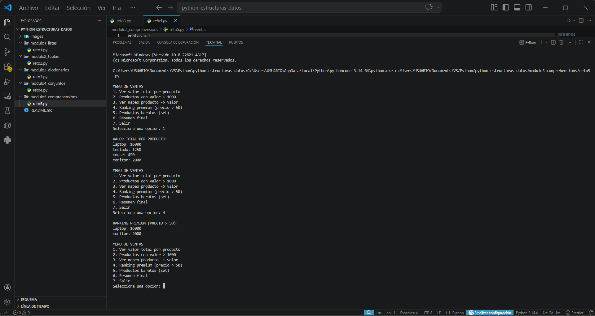

# Proyecto de Estructuras de Datos en Python

**Nombre:** [Santiago Pinzon Gallego]  
**Ficha:** 3114227

---

## Descripción del Proyecto

Este proyecto es el resultado de mi proceso de aprendizaje en el curso de Python, enfocado en entender y aplicar las estructuras de datos fundamentales que ofrece el lenguaje. A través de cinco módulos prácticos, desarrollé pequeños programas que simulan situaciones reales: desde gestionar un inventario de productos hasta analizar ventas de una empresa.

Cada módulo representa una estructura de datos distinta y contiene un reto resuelto que puse a prueba mediante un menú interactivo en consola.

---

## Temas Aprendidos

A lo largo de este proyecto trabajé y comprendí los siguientes conceptos:

1. **Listas:** Aprendí que son colecciones ordenadas y modificables. Las usé para crear un inventario donde puedo agregar productos, vender, actualizar precios y consultar el stock disponible.

2. **Tuplas:** Entendí que son colecciones ordenadas pero inmutables, ideales para datos que no deben cambiar, como la información de una película (título, director, año y calificación).

3. **Diccionarios:** Descubrí cómo almacenar datos en pares de llave y valor. Esto me permitió organizar ventas por regiones y trimestres, facilitando cálculos como totales y porcentajes.

4. **Conjuntos (Sets):** Aprendí que no tienen orden y no permiten duplicados. Los usé para comparar qué productos venden varias tiendas y qué géneros de películas comparten diferentes usuarios.

5. **Comprehensions:** Descubrí una forma elegante y rápida de crear listas, diccionarios o conjuntos en una sola línea de código, aplicando filtros y transformaciones a los datos de ventas.

---

## Evidencia de Retos Resueltos

### Reto 1: Gestión de Inventario (Listas)
Se desarrolló un sistema que permite controlar un inventario de productos. El usuario puede ver el stock, registrar ventas, agregar nuevos productos o actualizar los precios existentes.

**Ubicación:** `modulo1_listas/reto1.py`

### Reto 2: Catálogo de Películas (Tuplas)
Se creó un catálogo de películas donde cada una guarda su información en una tupla. El programa permite agregar nuevas películas, buscar por director y calcular estadísticas como la nota más baja, la más alta y el promedio.

**Ubicación:** `modulo2_tuplas/reto2.py`

### Reto 3: Análisis de Ventas por Región (Diccionarios)
Se analizaron las ventas trimestrales de cuatro regiones. El sistema calcula el total anual por región, identifica la región con mayores ventas, suma las ventas por trimestre y muestra el porcentaje que representa cada región.

**Ubicación:** `modulo3_diccionarios/reto3.py`

### Reto 4: Comparación de Tiendas y Gustos (Conjuntos)
Se compararon los productos de tres tiendas y los gustos de tres usuarios. Se aplicaron operaciones como unión (todos los productos), intersección (lo que comparten), diferencia (lo exclusivo) y verificación de subconjuntos.

**Ubicación:** `modulo4_conjuntos/reto4.py`

### Reto 5: Procesamiento de Ventas (Comprehensions)
Se procesó una lista de productos usando comprehensions. Se calcularon valores totales, se filtraron productos según su precio y se generaron rankings ordenados, todo en pocas líneas de código.

**Ubicación:** `modulo5_comprehensions/reto5.py`

---

## Capturas de Ejecución

A continuación se muestran las evidencias visuales de la ejecución de cada reto:

### Reto 1 - Inventario

### Reto 2 - Catálogo de Películas

### Reto 3 - Análisis de Ventas

### Reto 4 - Conjuntos y Comparaciones

### Reto 5 - Comprehensions

---

## Reflexión Personal del Aprendizaje

Este proyecto me ayudó a entender que elegir la estructura de datos correcta hace una gran diferencia al programar. Al principio me costaba distinguir cuándo usar una lista o un diccionario, pero al desarrollar los retos vi claramente sus ventajas: las listas son excelentes cuando necesito modificar datos; las tuplas me dan seguridad de que la información no cambiará; los diccionarios son perfectos para organizar datos por categorías; y los conjuntos me ahorran mucho trabajo cuando necesito comparar grupos de datos sin preocuparme por duplicados.

La parte de comprehensions fue la que más se me complicó... Aunque alcance a comprender algunos conceptos me ayude de ejemplos para poder realizar el reto, pero aun asi no lo tengo claro del todo.
